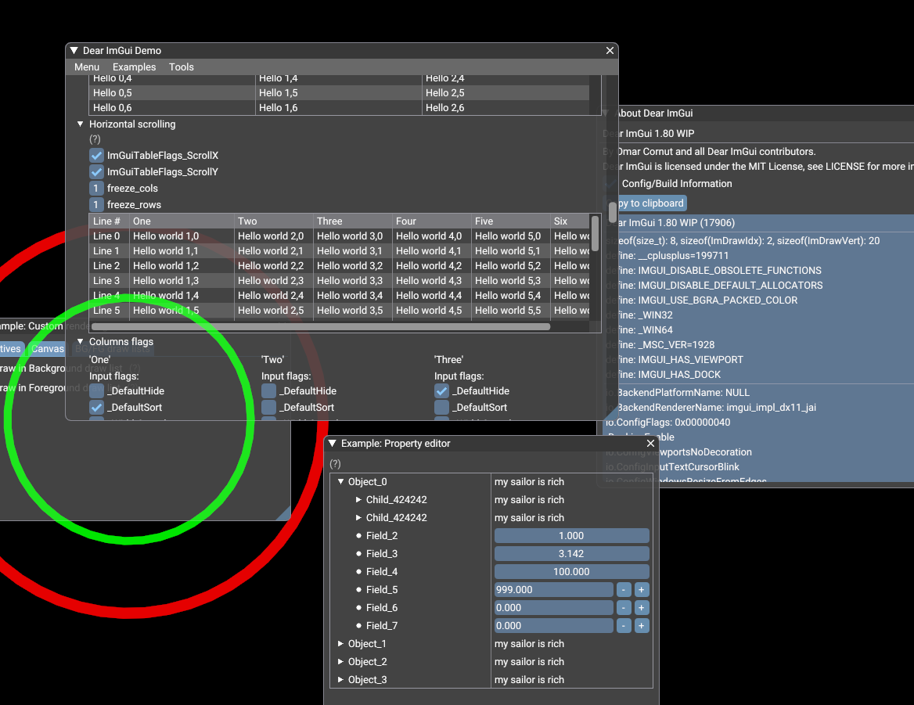

# jai-imgui


### NOTE: Jai comes with a working ImGui module. It's just based on an older version, and written by hand.

This is an alpha-state alternate [Dear ImGui](https://github.com/ocornut/imgui) wrapper for Jai with an automatic C++ <-> Jai bindings generator.



Currently this repo has binaries for the `docking` branch of ImGui 1.80 WIP.

Windows only at the moment. (If you want to add macOS or Linux support, you'll need to implement a function like `get_windows_symbols` which demangles C++ function names from the DLL for your platform. Please send a pull request if you do!) The Windows code uses [dumpbin.exe](https://docs.microsoft.com/en-us/cpp/build/reference/dumpbin-reference) for this purpose.

The meat of this project is in [generate_jai_wrapper.py](generate_jai_wrapper.py). (In the future I would like to move all of my bindings to use `jaicc`, the example clang-based program that ships with Jai as an example, which is a more automatic and future-proof solution.)

This project makes an effort to preserve the convenience of the C++ API by:

* maintaining default argument values
* turning `label` and `label_end` `const char *` arguments into Jai strings
* providing a module parameter for whether to link statically against ImGui or not

## Building demos

`jai build.jai`

Then run

`example_null.exe` to see a command-line (non-graphical) test of the bindings, or

`example_opengl.exe` to see the ImGui demo window. In this second example, you can go to `Examples->Dockspace` to test out docking.

One gotcha here: there's an ImGui module included in Jai. The demos expect THIS ImGui library to be `#import`ed. So your build script in your own project must modify the modules path. See `build.jai`.

## Regenerating bindings from scratch

Note: This project utilizes the metadata generated by the `cimgui` but generates `.jai` module files that directly link to the C++ ImGui DLL (or static library), so no `cimgui.dll` is required in your actual project.
```
Make sure we have the `cimgui/` folder, IT has its own `imgui/` folder.

git submodule update --init --recursive
```

Build `win/static/imgui.lib` and `win/dll/imgui.dll`.

```
build_windows_libs.bat
```

Generate cimgui's description JSON files.

```
generate_cimgui_json.bat
```

And finally generate the jai bindings.

```
generate_bindings.bat
```

## TODO

* There are still lots of missing functions
* There are many functions taking a single *u8 string argument which could use a Jai-string wrapper
